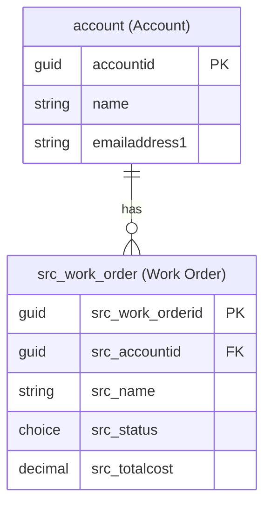

# Dataverse Schema Designer

**Triggers**: dataverse-schema, data model, design tables, Dataverse schema, entities, ER diagram
**Aliases**: /schema, /dataverse-schema, /data-model

---

## Instructions

Follow these steps in order for every `/data-model` invocation.

### Step 1: Verify Environment

```powershell
pac auth list
pac env who
```

If there is no authentication, tell the user to run:

```powershell
pac auth create --environment https://your-env.crm.dynamics.com
```

### Step 2: Gather Information

Use `AskUserQuestion` to ask the following questions, one by one if they are not already clear from context:

1. **"What is the business domain?"** - Briefly describe what the system manages.
2. **"What is the publisher prefix?"** - For example, `src_`. If the user does not know it:
   ```powershell
   pac env who --json
   ```
3. **"Are there existing tables to reuse?"** - Contact, Account, Lead, Opportunity, or custom tables.

If the user already provided the domain description when invoking `/data-model`, use that context directly.

### Step 3: Inspect Existing Tables And Relationships

Use the Dataverse inspection flow that works in this environment instead of relying on `pac modelbuilder list --type entity`.

This step must always inspect both:
1. **Column metadata** for each relevant table
2. **Relationship metadata** for each relevant table

Never assume the absence of a lookup column means there is no relationship. Dataverse relationships can exist as:
- `N:1` or `1:N` through lookup columns
- Native `N:N` relationships exposed only through relationship metadata

Primary inspection flow:
1. Use the Dataverse table listing capability to discover candidate tables in the environment.
2. Use table description/introspection to inspect each relevant table in detail.
3. Inspect relationship metadata for the same tables, including `1:N`, `N:1`, and `N:N` relationships.
4. Inspect both:
     - Tables explicitly mentioned by the user
     - Standard tables that might satisfy the requirement without distorting their natural purpose

Expected inspection sequence:
- List tables in the environment
- Identify candidate standard tables such as `account`, `contact`, `incident`, `product`, `connection`, `customeraddress`, `msdyn_*`, and relevant custom tables
- Describe each relevant table to capture:
    - Existing columns
    - Data types
    - Lookups and related tables
    - Choice values when relevant
    - Structural fit with the requirement
- Inspect relationship metadata to capture:
    - Existing `1:N` relationships
    - Existing `N:1` relationships
    - Existing native `N:N` relationships
    - Relationship schema names when relevant to the recommendation

Required output from this step:
- Reused tables that are a good fit
- Standard tables reviewed but rejected as the primary model
- Field-level evidence supporting the recommendation
- Relationship-level evidence supporting the recommendation
- An explicit statement of whether the recommendation depends on `1:N`, `N:1`, `N:N`, or a new relationship to be created

Tooling guidance:
- Use microsoftdocs-mcp server as one of the resources to get information and design the data model
- Prefer Dataverse MCP table discovery and table description/introspection as the default workflow in this repository/environment
- When relationship metadata is not visible from table description alone, use `pac modelbuilder build` filtered to the relevant entities to inspect generated relationship constants and `RelationshipSchemaName` attributes
- Keep `pac auth list` and `pac env who` for environment validation only
- Do not assume `pac modelbuilder list --type entity` is available
- Do not conclude that a table is unrelated until relationship metadata has been checked explicitly

### Step 4: Design the Data Model

#### Table Naming

| Type | Example | Rule |
|------|---------|------|
| Custom table | `src_work_order` | `{prefix}_{entity_name}` in snake_case |
| Reused standard table | `account`, `contact` | Original logical name without prefix |
| N:N relationship | `src_contact_src_project` | `{prefix}_{entity1}_{prefix}_{entity2}` |

#### Column Naming

| Type | Example | Rule |
|------|---------|------|
| Custom simple | `src_totalamount` | `{prefix}_{columnname}` in snake_case |
| Custom lookup | `src_accountid` | `{prefix}_{referencedentity}id` |
| Reused standard column | `name`, `statuscode` | No prefix |

#### Available Column Types

| Type | When to use |
|------|-------------|
| `SingleLine.Text` | Short text (up to 4000 chars) |
| `MultiLine.Text` | Long text, notes, descriptions |
| `WholeNumber` | Integers |
| `Decimal` | Decimal numbers |
| `Currency` | Monetary values. Prefer Currency over Decimal for money. |
| `DateTime` | Date and/or time |
| `Boolean` | Yes/No |
| `Choice` | Option set. Provide the options. |
| `Choices` | Multi-select option set |
| `Lookup` | Foreign key to another table |
| `Customer` | Special lookup to Account or Contact |
| `Owner` | Special lookup to User or Team |
| `Image` | Image |
| `File` | File attachment |
| `Uniqueidentifier` | GUID, primary key only |

#### Design Best Practices

1. **Reuse standard tables first**: Account, Contact, Team, User, and others before creating custom tables.
2. **Primary column**: Always define the primary column name explicitly. The default is usually `name`.
3. **Status and Status Reason**: Include them when the table has a lifecycle.
4. **Ownership**: Prefer User-owned unless Organization-owned is clearly better.
5. **N:N relationships**: Use the native Dataverse intersect relationship when appropriate.
6. **Virtual Tables**: Use for external data without replication.
7. **Elastic Tables**: Use for very high-volume telemetry or operational data, typically above 1 million rows per day.
8. **Calculated columns**: Use for values derived from other columns.
9. **Rollup columns**: Use for aggregations from child records.
10. **Propose standard tables only if their original purpose is not distorted.** If the fit is partial, clearly state which existing fields would be reused, which fields would remain unused, which new fields would be required, and how that would affect the natural purpose of the standard table.
11. **Always evaluate relationships before finalizing the design.** Explicitly account for existing `1:N`, `N:1`, and `N:N` relationships so the recommendation does not miss a native association already present in Dataverse.

### Step 5: Present the Design in Plan Mode

Use `EnterPlanMode` to present the complete design:

```markdown
## Data Model: [Domain Name]

**Publisher Prefix**: `src_`

### Tables

#### [Table 1: src_work_order] - New
**Display Name**: Work Order | **Ownership**: User-owned

| Column (Logical Name) | Display Name | Type | Required | Notes |
|-----------------------|--------------|------|----------|-------|
| `src_work_orderid` | Work Order | Uniqueidentifier | Yes | PK |
| `src_name` | Title | SingleLine.Text | Yes | Primary column |
| `src_description` | Description | MultiLine.Text | No | |
| `src_status` | Status | Choice | Yes | Options: Open, In Progress, Completed, Cancelled |
| `src_accountid` | Account | Lookup (account) | No | |
| `src_totalcost` | Total Cost | Currency | No | |
| `createdon` | Created On | DateTime | Auto | System field |
| `ownerid` | Owner | Owner | Auto | System field |

**Relationships**:
- N:1 with `account` - One account can have many work orders

#### [Table 2: contact] - Reused (standard)
Used as-is. Relevant fields: `fullname`, `emailaddress1`, `telephone1`.

### Relationships Reviewed

This section is **mandatory**. Include both:
1. Existing relationships actually found (`1:N`, `N:1`, `N:N`)
2. Rejected conceptual candidates even if no relationship currently exists in metadata

Do not omit N:N relationships.

| Relationship Schema Name | Type | Tables | Decision | Notes |
|--------------------------|------|--------|----------|-------|
| `src_account_src_work_order` | 1:N (new) | account → src_work_order | Proposed | Lookup `src_accountid` on new table |
| `bshcs_incident_bshcs_exampletable` | N:N (existing) | incident ↔ example_table | Reused / Rejected | Reason |
| `N/A (conceptual candidate)` | Conceptual candidate (not existing relationship) | incident ↔ connection | Rejected | Considered as candidate table option; rejected with rationale |
| `N/A (conceptual candidate)` | Conceptual candidate (not existing relationship) | incident ↔ customeraddress | Rejected | Considered as candidate table option; rejected with rationale |

> If no native relationship exists between two tables, state that explicitly and still include the conceptual candidate row in this section.

### Rejected Table Options (Fixed Component - Mandatory)

This section is **mandatory** and must be included in every generated data model output.

| Table Candidate | Why It Looked Viable | Why It Was Rejected For This Case-Subgrid-Driven Process |
|-----------------|----------------------|-----------------------------------------------------------|
| `connection` | [Explain initial attractiveness] | [Explain exact process and governance rejection reasons] |
| `customeraddress` | [Explain initial attractiveness] | [Explain exact process and semantic rejection reasons] |

### Fit/Gap Comparison Matrix (Fixed Component - Mandatory)

| Evaluation Criterion | `connection` | `customeraddress` |
|----------------------|--------------|-------------------|
| Subgrid creation fit | [Fit/GAP rating + short justification] | [Fit/GAP rating + short justification] |
| Partner-function semantics | [Fit/GAP rating + short justification] | [Fit/GAP rating + short justification] |
| Case-scoped transaction fit | [Fit/GAP rating + short justification] | [Fit/GAP rating + short justification] |
| Alignment with original table purpose | [Fit/GAP rating + short justification] | [Fit/GAP rating + short justification] |
| Operational complexity | [Low/Medium/High + short justification] | [Low/Medium/High + short justification] |

### Rejection Conclusion (Fixed Component - Mandatory)

Provide a short conclusion that explicitly ties the rejected options back to the selected architecture and business process.

### ER Diagram


```

### Step 6: Generate Documentation

After creating the model, automatically generate:
1. An ER diagram in Mermaid format.
2. A `data-model.md` file with the full table and column definition.

### Step 7: Final Summary

Provide:
- A list of proposed new tables and reused existing tables. Give a brief justification for each reused standard table, explaining how it fits the requirements without distorting its original purpose.
- Strong arguments and validations for the decisions made, especially if proposing reuse of standard tables. Look for info using the microsoftdocs-mcp server
- A relationship summary that explicitly lists the relevant existing `1:N`, `N:1`, and `N:N` relationships reviewed, including relationship schema names when they materially affect the recommendation
- The mandatory fixed components from Step 5 for rejected table options: viability rationale, exact rejection rationale, fit/gap comparison matrix, and rejection conclusion tied to the selected architecture
- The final ER diagram in Mermaid format.