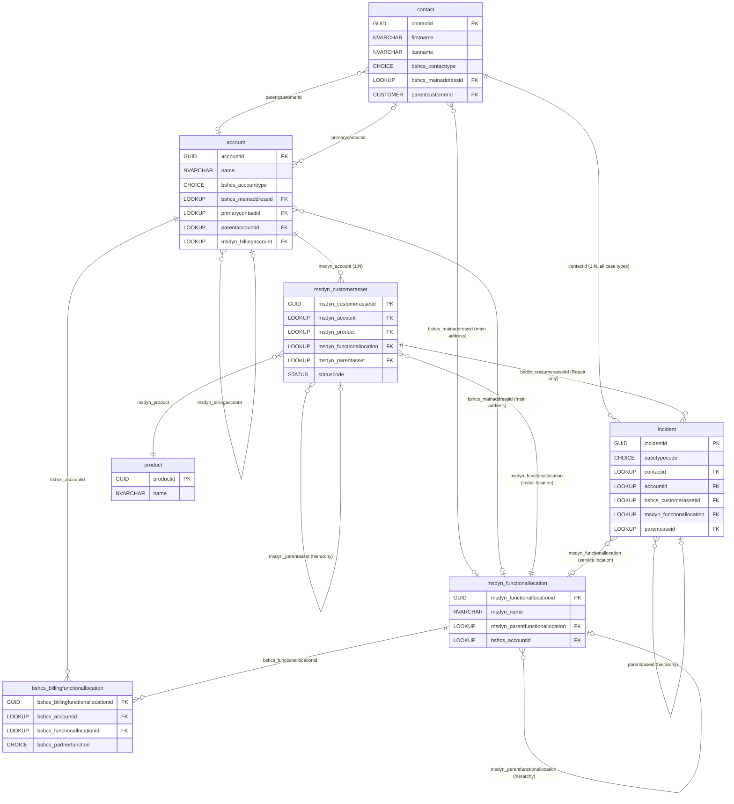
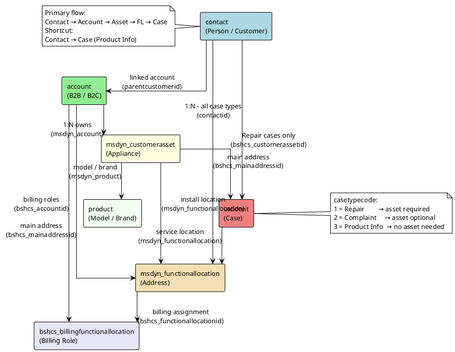

# Core Tables — Data Model Reference v3

> **Environment**: Dataverse (D365 Customer Service + Field Service)  
> **Source**: BSH_Paramount_Dynamics_Field_Overview 1.xlsx + live Dataverse schema  
> **Generated**: 2026-04-22  
> **Publisher prefix (custom)**: `bshcs_`  
> **Version**: 3.0 — Excludes "Account (OBSOLETE)" and "Work Order" tabs  
> **Changes from v2**: Reordered sections to reflect primary data flow (Contact → Account → Asset → Functional Location → Case → Billing FL) · **New direct relationship: contact → incident (1:N)** · Added Product Information case type (asset not required) · `bshcs_customerassetid` now conditional (required for Repair only) · Updated relationship diagram and matrix

---

## Primary Data Flow

```
Contact ──► Account ──► Customer Asset ──► Functional Location ──► Case ──► Billing Functional Location
   │                                                                  ▲
   └─────────────────────────────────────────────────────────────────┘
              (direct 1:N for Product Information type cases)
```

> **Repair cases** follow the full path: Contact → Account → Asset → Functional Location → Case.  
> **Product Information cases** can be raised directly against a Contact without an Account or Asset path.

---

## Table of Contents

1. [contact — Person / Customer](#1-contact--person--customer)
2. [account — Customer (B2B & B2C)](#2-account--customer-b2b--b2c)
3. [msdyn_customerasset — Appliance / Asset](#3-msdyn_customerasset--appliance--asset)
4. [msdyn_functionallocation — Functional Location (Address)](#4-msdyn_functionallocation--functional-location-address)
5. [incident — Case (type: Repair / Product Information)](#5-incident--case-type-repair--product-information)
6. [bshcs_billingfunctionallocation — Billing Functional Location](#6-bshcs_billingfunctionallocation--billing-functional-location)
7. [Relationship Diagram](#7-relationship-diagram)
8. [Field Mapping: Business Name → Logical Name](#8-field-mapping-business-name--logical-name)

---

## 1. `contact` — Person / Customer

> **Type**: OOB + Custom extensions (`bshcs_`) | **Ownership**: User  
> **Description**: Individual person — may be standalone (B2C Guest/OneAccount) or linked to a corporate account (B2B). A contact is the primary anchor of the data model: it can own cases directly (Product Information type) or be the entry point into the full Repair path via Account → Asset.

### Contact Type Behavior

| Type | Code | Description |
|------|------|-------------|
| Guest Account | Default | Created in Dynamics by CC agent; not authenticated |
| One Account | Integration | Identity coming from CAaaS (authenticated OneAccount user) |

> On creation in Dynamics, default is always **Guest Account**. OneAccount type is set by integration only.

### Case Relationship

A contact can be related to cases in two ways:

| Path | Case Type | Asset Required | Account Required |
|------|-----------|---------------|-----------------|
| Contact → Account → Asset → Case | Repair | **Y** | **Y** |
| Contact → Case (direct) | Product Information | N | N |

> ⚠️ **Business rule**: Product Information cases can be raised directly against a Contact even when no Account or Asset exists in the system.

### Columns

| Column | Logical Name | Type | Mandatory | R/W | Notes |
|--------|-------------|------|-----------|-----|-------|
| Contact ID | `contactid` | GUID PK | Y | R | System-generated |
| First Name | `firstname` | NVARCHAR(50) | Y | R/W | |
| Last Name | `lastname` | NVARCHAR(50) | Y | R/W | |
| Title | `bshcs_titleid` | CHOICE | N | R/W | Country-specific. Definition table vs dropdown pending. |
| Name Supplement | `bshcs_namesupplement` | CHOICE | N | R/W | Country-specific. Definition table vs dropdown pending. |
| Account Name | `parentcustomerid` | CUSTOMER → account | N | R/W | Linked account |
| Mobile Phone | `mobilephone` | PHONE(50) | N* | R/W | *One of mobile/email/phone required at CC creation |
| Email Address | `emailaddress1` | EMAIL(100) | N* | R/W | |
| Telephone | `telephone1` | PHONE(50) | N* | R/W | |
| Contact Method | `preferredcontactmethodcode` | CHOICE | N | R/W | Any/Email/Phone/Fax/Mail |
| Opt In | `msdyn_gdproptout` | BIT | N | R/W | Marketing opt-in |
| **Main Address** | **`bshcs_mainaddressid`** | **LOOKUP → msdyn_functionallocation** | N | R/W | 1:N relationship with Functional Location |
| Gender | `gendercode` | CHOICE | N | R/W | Male (1), Female (2) |
| Birthday | `birthdate` | DATE ONLY | N | R/W | |
| Correspondence Language | `bshcs_correspondancelanguage` | CHOICE | N | R/W | Country-specific language list |
| **Contact Type** | **`bshcs_contacttype`** | **CHOICE** | **Y** | R (set by system/integration) | **Guest Account, One Account** |
| **Create Household Account** | **`bshcs_createhouseholdaccount`** | **BIT** | N | R/W | Triggers auto-creation of B2C account |
| Status | `statecode` | STATE(INT) | Y | R/W | Active (0), Inactive (1) |
| **BUPA ID** | `bshcs_bupaid` | NVARCHAR(100) | N | **R** | Integration — GDS. TBD |
| **OneAccount Indicator** | `bshcs_oneaccountindicator` | BIT | N | **R** | Integration |
| **OneAccount Email** | `bshcs_oneaccountemail` | EMAIL(100) | N | **R** | Integration |
| **Transaction Block / Blacklist** | `bshcs_transactionblockreason` | NVARCHAR(200) | N | **R** | Integration with FI |
| Contact Person Name | `bshcs_contactperson` | NVARCHAR(100) | N | R/W | Secondary contact person |
| Contact Person Phone | `bshcs_tfnocontactperson` | PHONE(50) | N | R/W | Data validation |
| Contact Person Email | `bshcs_emailcontactperson` | EMAIL(100) | N | R/W | |
| Dealer | `bshcs_dealer` | NVARCHAR(200) | N | **R** | Info retrieved from M0P |
| Landlord | `bshcs_landlord` | NVARCHAR(200) | N | R/W | |
| Shared Living | `bshcs_sharedliving` | BIT | N | R/W | |
| Parent Contact | `parentcontactid` | LOOKUP → contact | N | R/W | Hierarchy |
| SLA | `slaid` | LOOKUP → sla | N | R/W | |
| GDPR Opt-out | `msdyn_gdproptout` | BIT | N | R/W | |
| Is Minor | `msdyn_isminor` | BIT | N | R/W | GDPR |
| Portal Username | `adx_identity_username` | NVARCHAR(100) | N | R | Power Pages |
| Portal Last Login | `adx_identity_lastsuccessfullogin` | DATETIME | N | R | |
| Owner | `ownerid` | OWNER | Y | R/W | |
| Created On | `createdon` | DATETIME | Y | R | |
| Modified On | `modifiedon` | DATETIME | Y | R | |
| Row Version | `versionnumber` | BIGINT | Y | R | |

> ⚠️ **Business rule**: At CC agent creation, at least one of Mobile Phone, Email Address, or Telephone must be provided.  
> ⚠️ **Business rule**: `bshcs_contacttype` defaults to **Guest Account** on creation in Dynamics. Only set to **One Account** via CAaaS integration.  
> ⚠️ **Relationship**: `bshcs_mainaddressid` links a contact to a **Functional Location** (N:1 — many contacts can share the same FL as main address).  
> ⚠️ **Relationship**: A contact can have **multiple cases** linked via `contactid` on the incident table (1:N). For Product Information cases this is the only required anchor.

---

## 2. `account` — Customer (B2B & B2C)

> **Type**: OOB + Custom extensions (`bshcs_`) | **Ownership**: User  
> **Description**: Business or household that represents a customer. Two sub-types: **B2B** (Partner/Corporate) and **B2C** (Household). Always reached through a Contact in the primary data flow.

### B2B vs B2C Behavior

| Aspect | B2B (`Account_B2B`) | B2C (`Account_B2C`) |
|--------|---------------------|---------------------|
| Account Type values | Partner, Corporate | Household |
| Account Name | Read-only (from system) | Mandatory, auto-named from contact |
| Main Address | Read-only (from FL) | Inherited from contact (automated account creation) |
| Account type field | Read-only | **Blocked after record creation** |
| Creation trigger | Manual / integration | Auto-created via "Create Household Account" checkbox on Contact |

### Columns

| Column | Logical Name | Type | Mandatory | R/W | Notes |
|--------|-------------|------|-----------|-----|-------|
| Account ID | `accountid` | GUID PK | Y | R | System-generated |
| Account Name | `name` | NVARCHAR(160) | Y | R/W (B2B) / R (B2C) | |
| Account Type | `bshcs_accounttype` | CHOICE | Y | **Blocked after creation (B2C)** | Individual (563910000), Corporate (563910001) |
| Corporate Name | `bshcs_corpname` | NVARCHAR(100) | N | R/W | B2B only |
| Corporate Name 2 | `bshcs_corpname2` | NVARCHAR(100) | N | R/W | B2B only |
| First Name | `bshcs_firstname` | NVARCHAR(100) | N | R/W | Individual/Household |
| Last Name | `bshcs_lastname` | NVARCHAR(100) | N | R/W | Individual/Household |
| Main Address | `bshcs_mainaddressid` | LOOKUP → **msdyn_functionallocation** | N | R | Address modelled as functional location |
| Telephone | `telephone1` | PHONE(50) | N | R/W | |
| Email Address | `emailaddress1` | EMAIL(100) | N | R/W | |
| Tax Number | `bshcs_taxnumber` | NVARCHAR(100) | N | R/W | Data validation TBD |
| Status | `statecode` | STATE(INT) | Y | R/W | Active (0), Inactive (1) |
| Status Reason | `statuscode` | STATUS(INT) | Y | R/W | Active (1), Inactive (2) |
| **BUPA ID** | `bshcs_bupaid` | NVARCHAR(100) | N | **R** | Integration — GDS. TBD |
| **OneAccount Indicator** | `bshcs_oneaccountindicator` | BIT | N | **R** | Integration |
| **OneAccount Email** | `bshcs_oneaccountemail` | EMAIL(100) | N | **R** | Integration |
| **Transaction Block / Blacklist** | `bshcs_transactionblockreason` | NVARCHAR(200) | N | **R** | Integration with FI |
| Billing Account | `msdyn_billingaccount` | LOOKUP → account | N | R/W | Separate billing account |
| Primary Contact | `primarycontactid` | LOOKUP → **contact** | N | R/W | |
| Parent Account | `parentaccountid` | LOOKUP → account | N | R/W | Account hierarchy |
| Preferred Contact Method | `preferredcontactmethodcode` | CHOICE | Y | R/W | Any/Email/Phone/Fax/Mail |
| Service Territory | `msdyn_serviceterritory` | LOOKUP → territory | N | R/W | Field Service |
| Sales Tax Code | `msdyn_salestaxcode` | LOOKUP → msdyn_taxcode | N | R/W | |
| Tax Exempt | `msdyn_taxexempt` | BIT | N | R/W | |
| Tax Exempt Number | `msdyn_taxexemptnumber` | NVARCHAR(20) | N | R/W | |
| Work Order Instructions | `msdyn_workorderinstructions` | MULTILINE TEXT | N | R/W | Field Service |
| Preferred Resource | `msdyn_preferredresource` | LOOKUP → bookableresource | N | R/W | |
| GDPR Opt-out | `msdyn_gdproptout` | BIT | N | R/W | |
| Originating BU | `bshcs_originatingbusinessunitid` | LOOKUP → businessunit | N | R | |
| Owner | `ownerid` | OWNER | Y | R/W | |
| Created On | `createdon` | DATETIME | Y | R | |
| Modified On | `modifiedon` | DATETIME | Y | R | |
| Row Version | `versionnumber` | BIGINT | Y | R | |

### Address Blocks (account)

Two OOB address blocks `address1_*` and `address2_*`. Note: **primary address is modelled via `bshcs_mainaddressid` → Functional Location** (not these blocks).

---

## 3. `msdyn_customerasset` — Appliance / Asset

> **Type**: Field Service OOB + Custom extensions (`bshcs_`) | **Ownership**: User  
> **Description**: Physical home appliance registered under a customer account, linked to a functional location (installation address). Required for Repair cases; not involved in Product Information cases.

### Asset Editability Rules

> ⚠️ Asset data (ENR, FD, dates, brand, category) **can be edited while status = Created**.  
> Once **confirmed by a technician** (Work Order completed), the data becomes **read-only**.  
> **No CC (Contact Center) role can ever edit asset data** — only Field Service technicians.

### Columns

| Column | Logical Name | Type | Mandatory | R/W | Notes |
|--------|-------------|------|-----------|-----|-------|
| Asset ID | `msdyn_customerassetid` | GUID PK | Y | R | System-generated |
| Asset Name | `msdyn_name` | NVARCHAR(100) | N | R/W | |
| **Account** | `msdyn_account` | LOOKUP → **account** | Y | R/W | Owner account — required |
| **Product / Model** | `msdyn_product` | LOOKUP → product | Y | R/W | Links to brand + product category |
| **Installation Location** | `msdyn_functionallocation` | LOOKUP → **msdyn_functionallocation** | N | R/W | Where appliance is installed |
| Asset Category | `msdyn_customerassetcategory` | LOOKUP → msdyn_customerassetcategory | N | R/W | Product category classification |
| **ENR** | `msdyn_assettag` | NVARCHAR(100) | N | R/W (if Created) | Equipment/Registration Number. Auto-filled dummy if not provided |
| **FD Number** | `bshcs_fdnumber` | INT | N | R/W (if Created) | Manufacturing date reference number |
| **Consecutive Number (Z-NR)** | `bshcs_consecutivenumber` | INT | N | R/W (if Created) | Set by CC or FS Technician. Max 6 digits |
| **Manufacturing Date** | `bshcs_manufacturingdate` | NVARCHAR(100) | N | R/W (if Created) | |
| **Purchase Date** | `bshcs_purchasedprice` | MONEY | N | R/W (if Created) | |
| **Purchase Price** | `bshcs_purchasedate` | DATE ONLY | N | R/W (if Created) | |
| **Installation Date** | `bshcs_installationdate` | DATE ONLY | N | R/W (if Created) | |
| **Warranty Start Date** | `bshcs_warrantystartdate` | DATE ONLY | N | R/W (if Created) | |
| **Warranty Status** | `bshcs_warrantystatus` | NVARCHAR(200) | N | **R** | Icon + text. Derived from contracts/warranty rules |
| **CEW Contract Number** | `bshcs_cewcontractnumber` | NVARCHAR(100) | N | **R** | CEW = Extended Warranty. Created internally |
| **Insurance Contract Number** | `bshcs_insurancecontractnumber` | NVARCHAR(100) | N | **R** | External insurance ref. — stored for contact only |
| **Home Connect ID** | `bshcs_homeconnectid` | NVARCHAR(100) | N | **R** | Direct integration with Home Connect |
| **Exchange Date** | `bshcs_exchangedate` | DATE ONLY | N | R/W | Exchange process |
| Asset Tag | `msdyn_assettag` | NVARCHAR(100) | N | R/W | Physical tag / barcode |
| Device ID (IoT) | `msdyn_deviceid` | NVARCHAR(100) | N | R/W | IoT device registration |
| IoT Registration Status | `msdyn_registrationstatus` | CHOICE | N | R | Unknown/Unregistered/In Progress/Registered/Error |
| IoT Alert | `msdyn_alert` | BIT | N | R | |
| Alert Count | `msdyn_alertcount` | INT | N | R | |
| Last Alert Time | `msdyn_lastalerttime` | DATETIME | N | R | |
| GPS Latitude | `msdyn_latitude` | FLOAT | N | R/W | |
| GPS Longitude | `msdyn_longitude` | FLOAT | N | R/W | |
| Parent Asset | `msdyn_parentasset` | LOOKUP → msdyn_customerasset | N | R/W | Asset hierarchy |
| Master Asset | `msdyn_masterasset` | LOOKUP → msdyn_customerasset | N | R | Set on exchange/merge |
| Work Order Product | `msdyn_workorderproduct` | LOOKUP → msdyn_workorderproduct | N | R | |
| **Appliance Status** | `statuscode` | STATUS(INT) | Y | **R** | System-populated — see table below |
| State | `statecode` | STATE(INT) | Y | R | Active (0), Inactive (1) |
| Owner | `ownerid` | OWNER | Y | R/W | |
| Created On | `createdon` | DATETIME | Y | R | |
| Modified On | `modifiedon` | DATETIME | Y | R | |
| Row Version | `versionnumber` | BIGINT | Y | R | |

### Brand & Product Category

Brand and product category are **not stored directly on the asset** — they are resolved through the `msdyn_product` lookup (product catalog). When an ENR is entered, the system **auto-populates** brand and product category from the product record.

| Brand Examples | Product Category Examples |
|----------------|--------------------------|
| Bosch, Balay, Siemens, Neff, Gaggenau, Thermador, Ikea | Refrigeration, Freezer, Dishwashers, Washing Machines, Tumble Dryers, Ovens, Surface Cooking, Coffee & Tea, Personal Care, Air Treatment |

> ⚠️ Brand list is **country-specific**.  
> ⚠️ When a **dummy appliance** is registered (no ENR), agent manually selects brand and product category.

### Appliance Status Lifecycle

| Status | Code | Trigger |
|--------|------|---------|
| Created | 563910001 | CC agent / web / external platform creates appliance |
| Verified | 563910003 | Technician validates appliance at Work Order completion |
| Cancelled | 563910002 | Manual change by CC agent (not recommended) |
| Exchanged | 563910004 | Exchange process |
| Refurbished | 563910005 | Refurbishment process — stock line B only |
| Scrapped | 563910006 | Refurbishment process — end of life |
| Active | 1 | Generic active state |
| Inactive | 2 | Deactivated |

---

## 4. `msdyn_functionallocation` — Functional Location (Address)

> **Type**: Field Service OOB + Custom extensions (`bshcs_`) | **Ownership**: User  
> **Description**: Hierarchical physical address/location where appliances are installed and services are performed. Used as the address model for Accounts, Contacts, and Assets. Sits between the Asset and the Case in the primary Repair flow.  
> **Note**: The sheet "Functional locations (OBSOLETE)" in the source Excel contains the business field specifications currently in use — the "OBSOLETE" label refers to a previous design iteration, not to the feature itself.

### Address Entry Modes

| Mode | Priority | Description |
|------|----------|-------------|
| **Bing / Global Map Search** | 1 | Agent types free text → map provider returns geocoded address → fields auto-filled |
| **Fuzzy Logic / Local Master Data** | 2 | Countries where global map providers are not suitable. Agent searches locally stored address master data |
| **Locally Required Fields** | 2 | Country-specific address fields (Area, Garden, Estate, Suburb, etc.) — configurable per country |
| **District for Türkiye** | 2 | Dropdown from locally maintained district master data (geographical areas too large for standard district field) |

### Columns

| Column | Logical Name | Type | Mandatory | R/W | Notes |
|--------|-------------|------|-----------|-----|-------|
| Location ID | `msdyn_functionallocationid` | GUID PK | Y | R | System-generated |
| Name | `msdyn_name` | NVARCHAR(60) | Y | R/W | Location identifier name |
| Short Name | `msdyn_shortname` | NVARCHAR(100) | N | R/W | |
| **Address Search Field** | `bshcs_addresssearchfield` | NVARCHAR(250) | Y | R/W (CC roles) | Free text for Bing / map provider. Auto-fills address fields on selection |
| **Street 1** | `msdyn_address1` | NVARCHAR(250) | Y | R/W (CC roles) | Auto-filled by map search |
| **Street 2** | `msdyn_address2` | NVARCHAR(250) | Country-dependent | R/W (CC roles) | |
| **Street 3** | `msdyn_address3` | NVARCHAR(250) | Country-dependent | R/W (CC roles) | |
| **House Number** | `bshcs_housenumber` | NVARCHAR(100) | Country-dependent | R/W (CC roles) | |
| **Flat / Apartment** | `bshcs_flatapartment` | NVARCHAR(100) | Country-dependent | R/W (CC roles) | |
| **Building Name** | `bshcs_buildingname` | NVARCHAR(200) | Country-dependent | R/W (CC roles) | Relevant for flats within a building |
| **Floor** | `bshcs_floor` | NVARCHAR(50) | Country-dependent | R/W (CC roles) | |
| **Room** | `bshcs_room` | NVARCHAR(50) | Country-dependent | R/W (CC roles) | |
| **Postal Code** | `msdyn_postalcode` | NVARCHAR(20) | Y | R/W (CC roles) | Auto-filled by map search |
| **City** | `msdyn_city` | NVARCHAR(80) | Y | R/W (CC roles) | Auto-filled by map search |
| **District** | `bshcs_district` | NVARCHAR(100) | Y | R/W (CC roles) | |
| **Region** | `bshcs_region` | NVARCHAR(100) | Country-dependent | R/W (CC roles) | Regions related to county |
| **State / Province** | `msdyn_stateorprovince` | NVARCHAR(50) | Country-dependent | R/W (CC roles) | |
| **Country** | `msdyn_country` | NVARCHAR(80) | Y | R/W (CC roles) | |
| **District for Türkiye** | `bshcs_districtturkey` | CHOICE | Country-dependent | R/W (CC roles) | Dropdown from local master data. Country=TR only |
| **Fuzzy Logic Search** | `bshcs_fuzzylogicsearch` | NVARCHAR(250) | N | R/W (CC roles) | For countries without global map provider |
| Address Composite | `bshcs_addresscomposite` | MULTILINE TEXT | N | R | Computed full address string |
| Address Name | `msdyn_addressname` | NVARCHAR(250) | N | R/W | Label for the address |
| GPS Latitude | `msdyn_latitude` | FLOAT | N | R/W | |
| GPS Longitude | `msdyn_longitude` | FLOAT | N | R/W | |
| Email Address | `msdyn_emailaddress` | EMAIL(100) | N | R/W | |
| Cost Center | `msdyn_costcenter` | NVARCHAR(100) | N | R/W | |
| Location Open Date | `msdyn_locationopendate` | DATE ONLY | N | R/W | |
| Primary Timezone | `msdyn_primarytimezone` | TIMEZONE(INT) | N | R/W | |
| Sequence | `msdyn_sequence` | INT | N | R/W | Display order within parent |
| Location Type | `msdyn_functionallocationtype` | LOOKUP → msdyn_functionallocationtype | N | R/W | |
| **Parent Location** | `msdyn_parentfunctionallocation` | LOOKUP → **msdyn_functionallocation** | N | R/W | Location hierarchy (self-referential) |
| **Owner Account** | `bshcs_accountid` | LOOKUP → **account** | N | R/W | Responsible account |
| State | `statecode` | STATE(INT) | Y | R/W | Active (0), Inactive (1) |
| Status | `statuscode` | STATUS(INT) | Y | R/W | Active (1), Inactive (2) |
| Owner | `ownerid` | OWNER | Y | R/W | |
| Created On | `createdon` | DATETIME | Y | R | |
| Modified On | `modifiedon` | DATETIME | Y | R | |
| Row Version | `versionnumber` | BIGINT | Y | R | |

> ⚠️ **Editability**: All address fields are editable **only by CC group roles**.  
> ⚠️ **Country-dependent fields**: Mandatory status and visibility of Street 2/3, House Number, Flat/Apartment, Building Name, Floor, Room, Region, State are controlled per country configuration.  
> ⚠️ **Locally Required Fields**: Countries like IN, AU, NZ, HK, ID, SG, VN, TH, TW use specific local field labels (Area, Garden, Estate, Suburb, etc.) — these must be configurable and addable per country.

---

## 5. `incident` — Case (type: Repair / Product Information)

> **Type**: Customer Service OOB + Custom extensions (`bshcs_`) | **Ownership**: User  
> **Description**: Service request case. Subject 1 drives the case type: **Repair** follows the full Contact → Account → Asset → FL path; **Product Information** can be raised directly against a Contact with no Account or Asset required.

### Case Type Behaviour

| Subject 1 | Code | Asset Required | Account Required | Contact Required | Functional Location |
|-----------|------|---------------|-----------------|-----------------|---------------------|
| Repair | 1 | **Y** | **Y** | Y | Optional |
| Product Information | 3 | **N** | N | **Y** | N/A |
| Complaint | 2 | N | Y | Y | Optional |

> ⚠️ **Repair cases**: `bshcs_customerassetid` is **mandatory**. Case cannot be saved without a linked asset.  
> ⚠️ **Product Information cases**: Asset and Account fields are **not required**. The case is anchored directly to the Contact via `contactid`.  
> ⚠️ **Subject 1 / Case Type** is auto-populated from IVR channel data where available.

### Columns

| Column | Logical Name | Type | Mandatory | R/W | Notes |
|--------|-------------|------|-----------|-----|-------|
| Case ID | `incidentid` | GUID PK | Y | R | System-generated |
| Transaction ID (Ticket) | `ticketnumber` | NVARCHAR(100) | Y | R | Auto-generated case number |
| Title | `title` | NVARCHAR(200) | Y | R/W | |
| Customer / Account | `customerid` | CUSTOMER → account, contact | Y | R | Populated from previous step (selection) |
| Account | `accountid` | LOOKUP → **account** | N | R | Required for Repair; not required for Product Information |
| **Contact** | **`contactid`** | **LOOKUP → contact** | **Y** | R/W | **Required anchor for all case types. 1:N — one contact can have multiple cases** |
| **Asset** | **`bshcs_customerassetid`** | **LOOKUP → msdyn_customerasset** | **Repair: Y / Product Info: N** | R/W | Auto-populated if identified in previous step. Not required for Product Information cases |
| **Subject 1 / Case Type** | `casetypecode` | CHOICE | Y | R/W | **Repair (1)**, Complaint (2), **Product Information (3)**. Auto-populated from IVR |
| **Subject 2 / Category Level 2** | `bshcs_subject2` | NVARCHAR(200) | Y | R/W | Category catalog (refined per country/product/case type) |
| **External Reference** | `bshcs_externalreference` | NVARCHAR(200) | N | R/W | Insurance, CEW, etc. Synced with Work Order |
| Origin | `caseorigincode` | CHOICE | N | R/W (auto) | Phone (1), Email (2), Web (3), WhatsApp, SoMe, Service Shops. Auto-populated from channel |
| **Diagnosis Code(s)** | `bshcs_qt_json` | MULTILINE TEXT | Y (Repair) | **R** | From Question Tree API. Not editable by user. Set via QT button. Not applicable for Product Information |
| **First Aid Given** | `bshcs_firstaidprovidedon` | DATETIME | Y (Repair) | **R** | Auto-populated from QT diagnosis selection |
| First Aid Auto-close | `bshcs_firstaidautoclose` | BIT | N | R | |
| **Notification Receipt Date** | `bshcs_notificationreceiptdate` | DATE ONLY | Y | R (auto) | Auto-set: Phone/Chat = case creation date; Email = first email date |
| Note | `description` | MULTILINE TEXT | N | R/W | Free text notes area |
| Caller | `bshcs_caller` | CUSTOMER → account, contact | N | R/W | Who raised the call |
| On-site Contact Name | `bshcs_onsitecontactname` | NVARCHAR(100) | N | R/W | |
| On-site Contact Email | `bshcs_onsitecontactemail` | EMAIL(100) | N | R/W | |
| On-site Contact Phone | `bshcs_onsitecontactphone` | PHONE(100) | N | R/W | |
| Due Date | `bshcs_duedate` | DATE ONLY | N | R/W | |
| Functional Location | `msdyn_functionallocation` | LOOKUP → **msdyn_functionallocation** | N | R/W | Service location. Relevant for Repair; not applicable for Product Information |
| Incident Type | `msdyn_incidenttype` | LOOKUP → msdyn_incidenttype | Y | R/W | Work order type mapping |
| Repair Batch | `bshcs_repairbatchcase` | LOOKUP → bshcs_repairbatch | N | R/W | |
| Primary Contact | `primarycontactid` | LOOKUP → contact | N | R/W | |
| SLA | `slaid` | LOOKUP → sla | N | R/W | |
| Parent Case | `parentcaseid` | LOOKUP → incident | N | R/W | Case hierarchy |
| Priority | `prioritycode` | CHOICE | N | R/W | High (1), Normal (2), Low (3) |
| Escalated | `isescalated` | BIT | N | R | |
| IoT Alert | `msdyn_iotalert` | LOOKUP → msdyn_iotalert | N | R | |
| Copilot Engaged | `msdyn_copilotengaged` | BIT | N | R | |
| Case Sentiment | `msdyn_casesentiment` | CHOICE | N | R | AI-driven |
| **State** | `statecode` | STATE(INT) | Y | R | Active (0), Resolved (1), Cancelled (2) |
| **Status** | `statuscode` | STATUS(INT) | Y | R/W | See table below |
| Owner | `ownerid` | OWNER | Y | R/W | |
| Created On | `createdon` | DATETIME | Y | R | |
| Modified On | `modifiedon` | DATETIME | Y | R | |
| Row Version | `versionnumber` | BIGINT | Y | R | |

### Case Status Lifecycle

| Status | Code | State | Trigger |
|--------|------|-------|---------|
| New | 563910009 | Active | Case just created |
| In Progress | 1 | Active | Agent working on it |
| On Hold | 2 | Active | Generic hold |
| On hold - Customer | 563910001 | Active | Waiting for customer |
| On hold - Internal | 563910003 | Active | Internal escalation |
| Waiting for Details | 3 | Active | |
| Researching | 4 | Active | |
| First Aid given | 563910002 | Active | QT first aid provided (Repair only) |
| First Aid Successful | 563910005 | Active/Resolved | Issue resolved via first aid (Repair only) |
| WO In Progress | 563910004 | Active | Work Order created and ongoing (Repair only) |
| WO Completed | 563910006 | Active | Technician completed WO (Repair only) |
| WO Cancellation | 563910007 | Active | WO was cancelled (Repair only) |
| Convert to Sales | 563910008 | Active | Redirected to sales process |
| Problem Solved | 5 | Resolved | |
| Information Provided | 1000 | Resolved | Typical closure for Product Information cases |
| Cancelled | 6 | Cancelled | Manual cancellation |
| Cancellation due to customer call | 563910010 | Cancelled | |
| Merged | 2000 | Cancelled | Duplicate merged |

> ⚠️ **Diagnosis code field** (`bshcs_qt_json`) is populated exclusively by the Question Tree API for Repair cases. Not applicable for Product Information cases.  
> ⚠️ **External Reference** is synced bidirectionally with the linked Work Order (Repair only).  
> ⚠️ **Notification Receipt Date** automation rules by channel: Phone/Chat → case creation date; Email → date of first inbound email.

---

## 6. `bshcs_billingfunctionallocation` — Billing Functional Location

> **Type**: Custom table (`bshcs_`) | **Ownership**: User  
> **Description**: Junction table assigning billing partner roles (SAP partner function pattern) to functional locations per account. Implements the N:M relationship between Account and Functional Location with a typed billing role. Sits at the end of the primary data flow, downstream of the Case.

### Columns

| Column | Logical Name | Type | Mandatory | Notes |
|--------|-------------|------|-----------|-------|
| Record ID | `bshcs_billingfunctionallocationid` | GUID PK | Y | System-generated |
| Name | `bshcs_name` | NVARCHAR(850) | N | Computed |
| **Account** | `bshcs_accountid` | LOOKUP → **account** | Y | Account assigned the billing role |
| **Functional Location** | `bshcs_functionallocationid` | LOOKUP → **msdyn_functionallocation** | Y | Location assigned the role |
| **Partner Function** | `bshcs_partnerfunction` | CHOICE | Y | Bill-to (0), Sold-to (1), Payer (2) |
| State | `statecode` | STATE(INT) | Y | Active (0), Inactive (1) |
| Status | `statuscode` | STATUS(INT) | Y | Active (1), Inactive (2) |
| Owner | `ownerid` | OWNER | Y | |
| Created On | `createdon` | DATETIME | Y | R |
| Modified On | `modifiedon` | DATETIME | Y | R |

### Partner Function Values

| Value | Code | SAP Equivalent | Description |
|-------|------|----------------|-------------|
| Bill-to | 0 | RE | Party to whom the invoice is sent |
| Sold-to | 1 | AG | Party who places the order |
| Payer | 2 | RG | Party who settles the invoice |

> ⚠️ One functional location can carry **multiple billing roles** for **different accounts**.

---

## 7. Relationship Diagram

```
┌─────────────────────────────────────────────────────────────────────────────────┐
│                              contact                                            │
│  bshcs_contacttype: Guest Account | One Account                                │
│  bshcs_mainaddressid ──────────────────────────────────────────────────────────►│
│  parentcustomerid ──────────────────────────────────────────────────────────── │
└────────────┬───────────────────────────────────────────────┬───────────────────┘
             │ parentcustomerid                             │ contactid (1:N)
             ▼                                             ▼
    ┌──────────────────────────────┐         ┌────────────────────────────────────┐
    │           account            │         │            incident                 │
    │  bshcs_accounttype: B2B/B2C  │         │  casetypecode: Product Information  │
    │  bshcs_mainaddressid ────────┼────────►│  (no asset or account required)    │
    │  primarycontactid ──────────►│         │  contactid ◄───────────────────── │
    └──────────┬───────────────────┘         └────────────────────────────────────┘
               │ msdyn_account (1:N)
               ▼
    ┌──────────────────────────────────┐
    │       msdyn_customerasset        │
    │  msdyn_account ─────────────────►│
    │  msdyn_product                   │
    │  msdyn_functionallocation ──────►│
    │  (parent/master self-ref)        │
    └──────────┬───────────────────────┘
               │ bshcs_customerassetid (required — Repair only)
               ▼
    ┌──────────────────────────────────────────────────────┐
    │                     incident                          │
    │  casetypecode: Repair                                 │
    │  customerid ────────────────────────────────────────►│ account / contact
    │  contactid ─────────────────────────────────────────►│ contact
    │  bshcs_customerassetid ─────────────────────────────►│ msdyn_customerasset
    │  msdyn_functionallocation ──────────────────────────►│ msdyn_functionallocation
    │  bshcs_caller ──────────────────────────────────────►│ account / contact
    │  parentcaseid (self) ───────────────────────────────►│ incident
    └──────────────────────────────────────────────────────┘
               │ (via account → msdyn_functionallocation)
               ▼
    ┌──────────────────────────────────┐
    │     msdyn_functionallocation     │
    │   (hierarchy: parent → self)     │
    │   bshcs_accountid ──────────────►│
    └──────────┬───────────────────────┘
               │ bshcs_functionallocationid (1:N)
               ▼
    ┌──────────────────────────────────────────┐
    │    bshcs_billingfunctionallocation        │
    │    bshcs_accountid ─────────────────────►│ account
    │    bshcs_functionallocationid ──────────►│ msdyn_functionallocation
    │    partnerfunction: Bill-to/Sold-to/Payer │
    └──────────────────────────────────────────┘
```

### Mermaid Diagram



### PlantUML Diagram



### Complete Relationship Matrix

| From Table | Column | To Table | Cardinality | Required | Notes |
|------------|--------|----------|-------------|----------|-------|
| `contact` | `parentcustomerid` | `account` | N:1 | N | Contact linked to account |
| `contact` | `bshcs_mainaddressid` | `msdyn_functionallocation` | N:1 | N | Main address as FL |
| `contact` | `parentcontactid` | `contact` | N:1 (self) | N | Contact hierarchy |
| **`contact`** | **`contactid` (via incident)** | **`incident`** | **1:N** | N | **Direct contact → many cases. Mandatory for Product Information cases** |
| `account` | `primarycontactid` | `contact` | 1:1 | N | Primary contact |
| `account` | `bshcs_mainaddressid` | `msdyn_functionallocation` | N:1 | N | Main address as FL |
| `account` | `msdyn_billingaccount` | `account` | N:1 (self) | N | Separate billing account |
| `account` | `parentaccountid` | `account` | N:1 (self) | N | Account hierarchy |
| `msdyn_customerasset` | `msdyn_account` | `account` | N:1 | **Y** | Owner account — required |
| `msdyn_customerasset` | `msdyn_product` | `product` | N:1 | **Y** | Product/model — required |
| `msdyn_customerasset` | `msdyn_functionallocation` | `msdyn_functionallocation` | N:1 | N | Installation location |
| `msdyn_customerasset` | `msdyn_parentasset` | `msdyn_customerasset` | N:1 (self) | N | Asset hierarchy |
| `msdyn_functionallocation` | `msdyn_parentfunctionallocation` | `msdyn_functionallocation` | N:1 (self) | N | Location hierarchy |
| `msdyn_functionallocation` | `bshcs_accountid` | `account` | N:1 | N | Owner account |
| `bshcs_billingfunctionallocation` | `bshcs_accountid` | `account` | N:1 | **Y** | |
| `bshcs_billingfunctionallocation` | `bshcs_functionallocationid` | `msdyn_functionallocation` | N:1 | **Y** | |
| `incident` | `contactid` | `contact` | N:1 | **Y** | **Required on all case types** |
| `incident` | `bshcs_customerassetid` | `msdyn_customerasset` | N:1 | **Repair: Y / Product Info: N** | Asset required for Repair; optional for Product Information |
| `incident` | `customerid` | `account` / `contact` | N:1 | Y | Polymorphic customer |
| `incident` | `accountid` | `account` | N:1 | N | Required for Repair; not required for Product Information |
| `incident` | `msdyn_functionallocation` | `msdyn_functionallocation` | N:1 | N | Service location (Repair only) |
| `incident` | `parentcaseid` | `incident` | N:1 (self) | N | Case hierarchy |

---

## 8. Field Mapping: Business Name → Logical Name

Quick reference for key business-facing field names used in the Excel spec.

| Business Name (Excel) | Entity | Logical Name | Type |
|-----------------------|--------|-------------|------|
| BUPA ID | account, contact | `bshcs_bupaid` | NVARCHAR(100) |
| OneAccount Indicator | account, contact | `bshcs_oneaccountindicator` | BIT |
| OneAccount Email | account, contact | `bshcs_oneaccountemail` | EMAIL(100) |
| Transaction Block / Blacklist | account, contact | `bshcs_transactionblockreason` | NVARCHAR(200) |
| Contact Type | contact | `bshcs_contacttype` | CHOICE |
| Create Household Account | contact | `bshcs_createhouseholdaccount` | BIT |
| Name Supplement | contact | `bshcs_namesupplement` | CHOICE |
| Correspondence Language | contact | `bshcs_correspondancelanguage` | CHOICE |
| Opt In | contact | `bshcs_optin` | BIT |
| Main Address (Contact) | contact | `bshcs_mainaddressid` | LOOKUP → msdyn_functionallocation |
| Contact Person | contact | `bshcs_contactperson` | NVARCHAR(100) |
| Contact Person Phone | contact | `bshcs_tfnocontactperson` | PHONE(50) |
| Contact Person Email | contact | `bshcs_emailcontactperson` | EMAIL(100) |
| Dealer | contact | `bshcs_dealer` | NVARCHAR(200) |
| Landlord | contact | `bshcs_landlord` | NVARCHAR(200) |
| Shared Living | contact | `bshcs_sharedliving` | BIT |
| ENR | msdyn_customerasset | `msdyn_assettag` | NVARCHAR(100) |
| Consecutive Number (Z-NR) | msdyn_customerasset | `bshcs_consecutivenumber` | INT |
| FD Number | msdyn_customerasset | `bshcs_fdnumber` | INT |
| Warranty Status | msdyn_customerasset | `bshcs_warrantystatus` | NVARCHAR(200) |
| CEW Contract Number | msdyn_customerasset | `bshcs_cewcontractnumber` | NVARCHAR(100) |
| Insurance Contract Number | msdyn_customerasset | `bshcs_insurancecontractnumber` | NVARCHAR(100) |
| Home Connect ID | msdyn_customerasset | `bshcs_homeconnectid` | NVARCHAR(100) |
| Exchange Date | msdyn_customerasset | `bshcs_exchangedate` | DATE ONLY |
| Appliance Status | msdyn_customerasset | `statuscode` | STATUS(INT) |
| External Reference | incident | `bshcs_externalreference` | NVARCHAR(200) |
| Notification Receipt Date | incident | `bshcs_notificationreceiptdate` | DATE ONLY |
| Subject 1 / Case Type | incident | `casetypecode` | CHOICE (Repair=1, Complaint=2, Product Information=3) |
| Subject 2 | incident | `bshcs_subject2` | NVARCHAR(200) |
| Diagnosis Code(s) | incident | `bshcs_qt_json` | MULTILINE TEXT |
| Address Search Field | msdyn_functionallocation | `bshcs_addresssearchfield` | NVARCHAR(250) |
| Building Name | msdyn_functionallocation | `bshcs_buildingname` | NVARCHAR(200) |
| Floor | msdyn_functionallocation | `bshcs_floor` | NVARCHAR(50) |
| Room | msdyn_functionallocation | `bshcs_room` | NVARCHAR(50) |
| District | msdyn_functionallocation | `bshcs_district` | NVARCHAR(100) |
| Region | msdyn_functionallocation | `bshcs_region` | NVARCHAR(100) |
| District for Türkiye | msdyn_functionallocation | `bshcs_districtturkey` | CHOICE |
| Fuzzy Logic Search | msdyn_functionallocation | `bshcs_fuzzylogicsearch` | NVARCHAR(250) |

---

*Generated by GitHub Copilot CLI — Solution Architect Agent*  
*Source: BSH_Paramount_Dynamics_Field_Overview 1.xlsx + live Dataverse environment schema*
