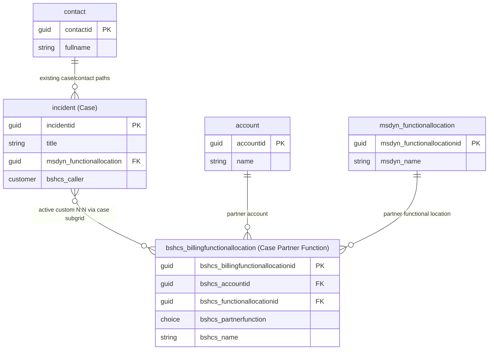

# Data Model: Case Partner Functions
## Contact Center - Home Appliances (Global)

**Generated by**: `/data-model` skill  
**Environment**: `bsh-paramount-DEV-CC` (`bsh-paramount-dev-cc.crm4.dynamics.com`)  
**User**: `dee7mu@bosch.com`  
**Publisher Prefix**: `bshcs_`  
**Date**: 2026-04-08

---

## 1. Scenario Context

A global Contact Center for home appliances needs Partner Functions at the Case level.

A Partner Function links **Account + Functional Location + Partner Function Type** to a **Case**.

Required role values:
- Sold-to
- Caller
- Bill-to
- Ship-to
- Extra Contact
- Payer

Confirmed simplification from business:
- `Sequence ordering` is not required
- `Primary flag per role` is not required
- `Split percentage` is not required

---

## 2. Tables Inspected

| Table | Type | Column Inspection | Relationship Inspection |
|-------|------|-------------------|------------------------|
| `incident` | Standard | `mcp_dataverse-mcp_describe_table` | `pac modelbuilder build` |
| `account` | Standard | `mcp_dataverse-mcp_describe_table` | `pac modelbuilder build` |
| `contact` | Standard | `mcp_dataverse-mcp_describe_table` | `pac modelbuilder build` |
| `msdyn_functionallocation` | Standard | `mcp_dataverse-mcp_describe_table` | `pac modelbuilder build` |
| `bshcs_billingfunctionallocation` | Custom (existing) | `mcp_dataverse-mcp_describe_table` | `pac modelbuilder build` |

---

## 3. Current Schema Evidence

### `bshcs_billingfunctionallocation` (current)

```
bshcs_accountid             LOOKUP (account)                  NOT NULL
bshcs_functionallocationid  LOOKUP (msdyn_functionallocation) NOT NULL
bshcs_partnerfunction       CHOICE (Bill-to: 0, Sold-to: 1, Payer: 2) NOT NULL
bshcs_name                  NVARCHAR(850)
```

### `incident` (relevant fields)

```
incidentid               GUID  PK
bshcs_caller             CUSTOMER (account/contact)
msdyn_functionallocation LOOKUP (msdyn_functionallocation)
customerid               CUSTOMER (account/contact)
```

---

## 4. Relationship Metadata

Inspected via `pac modelbuilder build --entitynamesfilter "incident;bshcs_billingfunctionallocation;account;contact;msdyn_functionallocation"`.

### Relationships Reviewed

| Relationship Schema Name | Type | Tables | Decision | Notes |
|--------------------------|------|--------|----------|-------|
| `bshcs_incident_bshcs_billingfunctionallocation` | N:N (existing, custom) | `incident` ↔ `bshcs_billingfunctionallocation` | **Active pattern (selected)** | Case subgrid creates multiple partner rows per case |
| `bshcs_billingfunctionallocation_account` | N:1 (existing) | `bshcs_billingfunctionallocation` -> `account` | Reuse | Existing required link |
| `bshcs_billingfunctionallocation_msdyn_functionallocation` | N:1 (existing) | `bshcs_billingfunctionallocation` -> `msdyn_functionallocation` | Reuse | Existing required link |
| `msdyn_msdyn_functionallocation_incident_FunctionalLocation` | N:1 (existing) | `incident` -> `msdyn_functionallocation` | Reuse | Existing case-level FL context |
| `bshcs_billingfunctionallocation_incident` | N:1 (new, proposed) | `bshcs_billingfunctionallocation` -> `incident` | Rejected | Not selected; business process requires case subgrid + existing N:N pattern |
| `bshcs_billingfunctionallocation_contact` | N:1 (new, proposed) | `bshcs_billingfunctionallocation` -> `contact` | Rejected | Not required for selected pattern |

> No native relationship exists between `bshcs_billingfunctionallocation` and `contact`.

---

## 5. Architecture Decision

### Selected approach

**Use the existing custom N:N relationship as the active pattern**: `bshcs_incident_bshcs_billingfunctionallocation`.

Business flow alignment:
1. User opens a Case (`incident`)
2. User adds partner function rows in the related subgrid
3. System creates associations through the existing custom N:N
4. Multiple billing/partner rows per case are naturally supported

Model updates needed in this approach:
1. Keep `bshcs_billingfunctionallocation` as the assignment row
2. Extend `bshcs_partnerfunction` choices to include Ship-to, Caller, Extra Contact
3. Keep existing links to `account` and `msdyn_functionallocation`

### Why this fixes the architecture

- It matches the required business process: create partner rows directly from the Case related subgrid
- It reuses the existing custom relationship already present in the environment
- It supports multiple partner rows per Case without creating another table
- It supports the simplified requirement set (no sequence/primary/split fields)

### Important rule

Use **one active pattern** for new records:
- Primary: existing custom N:N (`bshcs_incident_bshcs_billingfunctionallocation`) via Case subgrid

Do not keep both patterns active for new writes.

---

## 6. Recommended Design (Final)

### Table to use: `bshcs_billingfunctionallocation`

**Type**: Existing custom table | **Ownership**: User-owned

#### Existing columns to keep

| Column (Logical Name) | Display Name | Type | Required |
|---|---|---|---|
| `bshcs_accountid` | Partner Account | Lookup (`account`) | Yes |
| `bshcs_functionallocationid` | Functional Location | Lookup (`msdyn_functionallocation`) | Yes |
| `bshcs_partnerfunction` | Partner Function | Choice | Yes |
| `bshcs_name` | Name | Text | No |

#### Update choice: `bshcs_partnerfunction`

Current options:
- Bill-to (0)
- Sold-to (1)
- Payer (2)

Add options:
- Caller
- Ship-to
- Extra Contact

(Keep current numeric values unchanged for existing options.)

#### Relationships (target state)

| Relationship | Type | Referenced Table | Status |
|---|---|---|---|
| `bshcs_incident_bshcs_billingfunctionallocation` | N:N | `incident` ↔ `bshcs_billingfunctionallocation` | Existing and active |
| `bshcs_billingfunctionallocation_account` | N:1 | `account` | Existing |
| `bshcs_billingfunctionallocation_msdyn_functionallocation` | N:1 | `msdyn_functionallocation` | Existing |

#### Business rules

1. Partner rows are created from the Case subgrid using the existing custom N:N relationship.
2. Multiple partner rows per Case are allowed.
3. `bshcs_accountid` and `bshcs_functionallocationid` remain required on each partner row.

---

## 7. Reused Tables Summary

| Table | Action | Justification |
|-------|--------|---------------|
| `incident` | Reuse | Parent Case context and owner of the related subgrid experience |
| `account` | Reuse | Partner company reference |
| `msdyn_functionallocation` | Reuse | Functional location/address reference |
| `contact` | Reuse | Still available through existing Case/contact patterns where needed |
| `bshcs_billingfunctionallocation` | **Reuse + extend choices (selected)** | Assignment row table used by active N:N case-subgrid pattern |

### Rejected Options

#### Rejected architecture options

| Option | Verdict | Reason |
|--------|---------|--------|
| Add `bshcs_incidentid` lookup and make 1:N the primary pattern | Rejected | Business process explicitly requires creating rows from Case related subgrid using existing custom N:N |
| Add `bshcs_contactid` lookup | Rejected for now | Not required for selected process pattern |
| Create new `bshcs_casepartnerfunction` table | Rejected | Unnecessary extra table given existing custom N:N and current simplified requirements |

#### Rejected table options

| Table | Why it looked viable | Why it was rejected for this process |
|-------|----------------------|------------------------------------|
| `connection` | Already supports linking many record types and has role-based semantics through connection roles. | 1. `connection` is intended for informal/ad hoc relationships, while Partner Functions are process-driving data (billing, routing, notifications). 2. The Case subgrid pattern here needs deterministic assignment rows with required `account` + `functional location` + `partner function` values; `connection` would require extra indirection via roles and more complex filtering. 3. Governance/readability cost is higher for operations/reporting because business logic depends on role metadata rather than typed table columns. |
| `customeraddress` | Has Bill To / Ship To concepts and can store address details tied to customer records. | 1. Scope mismatch: `customeraddress` is customer master address data, not case-scoped assignment rows. 2. Missing partner-function semantics: it does not model Sold-to, Caller, Extra Contact, Payer in the same role framework. 3. Does not represent the required assignment triplet (`account` + `functional location` + partner function) as a case-owned relation. 4. Using it for case transactions would overload a master-data table with process-transaction meaning. |

Detailed fit/gap check used for rejection:

| Evaluation criterion | `connection` | `customeraddress` |
|---------------------|--------------|-------------------|
| Works naturally with Case related subgrid creation flow | Partial | Weak |
| Supports explicit partner-function semantics in one model | Partial (role indirection) | Weak |
| Aligns with case-scoped transactional assignments | Partial | No |
| Aligns with table's original purpose | Weak | Weak |
| Complexity / operational clarity | Higher complexity | Medium complexity with semantic mismatch |

Conclusion: neither `connection` nor `customeraddress` fits the selected business process as cleanly as the existing custom N:N pattern with `bshcs_billingfunctionallocation`.

---

## 8. ER Diagram (Target State)



---

## 9. Final Summary

Final architecture selected by business decision:
- Use existing custom N:N `bshcs_incident_bshcs_billingfunctionallocation` as active pattern
- Keep `bshcs_billingfunctionallocation` as partner assignment row
- Expand partner function choices to include Caller, Ship-to, Extra Contact
- Create/manage rows from Case related subgrid

This delivers case-scoped partner assignments aligned with the business process without introducing a new table and without adding unnecessary fields (sequence/primary/split).
