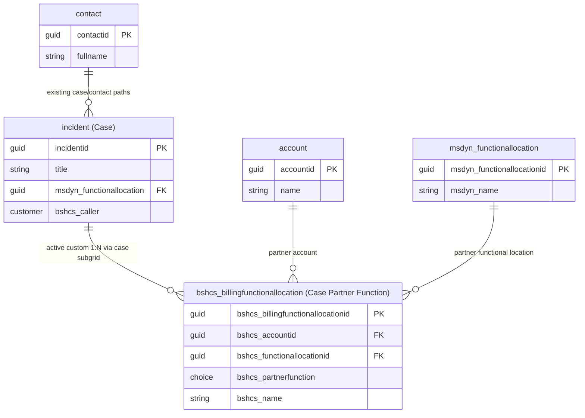

# Case Partner Functions (Billing Functional Locations)

## 1. Scenario Context

A Partner Function links **Account (or Contact?) + Functional Location + Partner Function Type** to a **Case**.

Partner Function values:
- Sold-to
- Caller
- Bill-to
- Ship-to
- Contact
- Payer

## 2. Tables Inspected

| Table | Type |
|-------|------|
| `incident` | Standard |
| `account` | Standard |
| `contact` | Standard |
| `msdyn_functionallocation` | Standard |
| `bshcs_billingfunctionallocation` | Custom |
| `connection` | Standard |
| `customeraddress` | Standard |

## 3. Relationship Metadata

### Relationships Reviewed

| Relationship Schema Name | Type | Tables | Decision | Notes |
|--------------------------|------|--------|----------|-------|
| `bshcs_incident_bshcs_billingfunctionallocation` | 1:N (existing, custom) | `incident` ↔ `bshcs_billingfunctionallocation` | Active pattern | Case subgrid creates multiple partner rows per case |
| `bshcs_billingfunctionallocation_account` | N:1 (existing) | `bshcs_billingfunctionallocation` -> `account` | Reuse | Existing required link |
| `bshcs_billingfunctionallocation_msdyn_functionallocation` | N:1 (existing) | `bshcs_billingfunctionallocation` -> `msdyn_functionallocation` | Reuse | Existing required link |
| `msdyn_msdyn_functionallocation_incident_FunctionalLocation` | N:1 (existing) | `incident` -> `msdyn_functionallocation` | Reuse | Existing case-level FL context |
| `N/A (conceptual candidate)` | Conceptual candidate (not existing relationship) | `incident` ↔ `connection` | Rejected | Case to partner function flow driven process. Informal relationship nature |
| `N/A (conceptual candidate)` | Conceptual candidate (not existing relationship) | `incident` ↔ `customeraddress` | Rejected | Customer master data. Case-scoped transaction semantics |

> No native relationship exists between `bshcs_billingfunctionallocation` and `contact`.

## 4. Architecture Proposal

### Current approach

**Use the existing custom 1:N relationship as the active pattern**: `bshcs_incident_bshcs_billingfunctionallocation`.

Business flow alignment:
1. User opens a Case (`incident`)
2. User adds partner function rows in the related subgrid
3. System creates associations through the existing custom 1:N
4. Multiple billing/partner rows per case are naturally supported

### Why this architecture design works

1. It matches the required business process: create Partner Functions directly from the Case

2. It supports multiple partner rows per Case without creating another table

3. Leverages the built-in Dynamics 365 related-subgrid pattern that Case handlers already use

4. The 6 partner function are stored directly on `bshcs_billingfunctionallocation`, making business logic and role-based filtering explicit and maintainable compared to generic relationship models like `connection`.

### Rejected Options

| Table | Why it looked viable | Why it was rejected for this process |
|-------|----------------------|------------------------------------|
| `connection` | Already supports linking many record types and has role-based semantics through connection roles. | 1. `connection` is intended for informal/ad hoc relationships, while Partner Functions are process-driving data (billing, routing, notifications). 
 2. The Case -> Partner Function pattern needs  assignment rows with required `account` + `functional location` + `partner function` values; `connection` would require extra handling via roles and more complex filtering. 
 3. Governance cost is higher for operations and reporting because business logic depends on role metadata rather than typed table columns. |
| `customeraddress` | Has Bill To / Ship To concepts and can store address details tied to customer records. | 1. Scope mismatch: `customeraddress` is customer master address data, not case-scoped assignment rows. 
 2. Missing partner-function semantics: it does not model Sold-to, Caller, Extra Contact, Payer in the same role framework.  
 3. Does not represent the required assignment triplet (`account` + `functional location` + partner function) as a case-owned relation. 
 4. Using it for case transactions would overload a master-data table with process-transactions. |

Fit/gap check used for rejection:

| Evaluation criteria | `connection` | `customeraddress` |
|---------------------|--------------|-------------------|
| Works naturally with Case related subgrid creation flow | Partial | Weak |
| Supports explicit partner-function semantics in one model | Partial (roles) | Weak |
| Aligns with case-scoped transactional assignments | Partial | No |
| Aligns with table's original purpose | Weak | Weak |
| Complexity / operational clarity | Higher complexity | Medium complexity with possible semantic mismatch |

## 5. Proposed Design

### Table to use: `bshcs_billingfunctionallocation`

**Type**: Custom table | **Ownership**: User-owned

#### Existing columns to keep

| Column (Logical Name) | Display Name | Type | Required |
|---|---|---|---|
| `bshcs_accountid` | Partner Account | Lookup (`account`) | Yes |
| `bshcs_functionallocationid` | Functional Location | Lookup (`msdyn_functionallocation`) | Yes |
| `bshcs_partnerfunction` | Partner Function | Choice | Yes |
| `bshcs_name` | Name | Text | No |

#### Update choice: `bshcs_partnerfunction`

Current options:
- Bill-to (0)
- Sold-to (1)
- Payer (2)

Add options:
- Caller
- Ship-to
- Extra Contact

#### Relationships

| Relationship | Type | Referenced Table |
|---|---|---|
| `bshcs_incident_bshcs_billingfunctionallocation` | 1:N | `incident` ↔ `bshcs_billingfunctionallocation` |
| `bshcs_billingfunctionallocation_account` | N:1 | `account` |
| `bshcs_billingfunctionallocation_msdyn_functionallocation` | N:1 | `msdyn_functionallocation` |

#### Business rules

1. Partner rows are created from the Case using the existing custom 1:N relationship.
2. Multiple partner rows per Case are allowed.
3. `bshcs_accountid` and `bshcs_functionallocationid` remain required on each partner row.  

## 6. Reused Tables Summary

| Table | Action | Justification |
|-------|--------|---------------|
| `incident` | Reuse | Parent Case context and owner of the related subgrid experience |
| `account` | Reuse | Partner Function reference |
| `msdyn_functionallocation` | Reuse | Functional location/address reference |
| `contact` | Reuse | Still available through existing Case/contact patterns where needed |
| `bshcs_billingfunctionallocation` | **Reuse + extend choices** | Assignment row table used by current 1:N case -> Partner Function pattern|

---

## 7. ER Diagram

